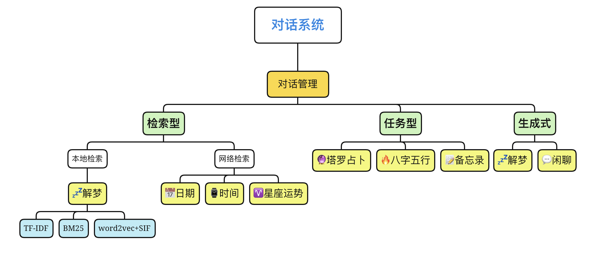

# TODO

### 系统架构

### 运行

`python dialog_manage.py`

### demo

### 预训练模型

用于生成式对话的预训练GPT2模型link:
https://pan.baidu.com/s/1LfZb3O9kvqAjdkdzOCa2Ew 提取码: rjor 

* epoch40 (生成式解梦)
   
* min_ppl_model (生成式解梦)
   
* model_epoch40_50w (闲聊)

#### usage

将模型文件夹(model_epoch40_50w)放到 `./GPT2/model` 文件夹下 
